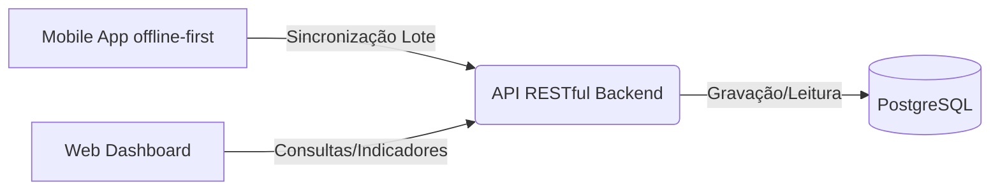

# 🏫 Sistema de Coleta de Dados Escolares (Solução Escalável)

Este repositório contém a documentação e os códigos-fonte da solução desenvolvida para a coleta, armazenamento, sincronização e apresentação de dados socioeconômicos de alunos e suas famílias.

O projeto foi projetado com um foco rigoroso em **escalabilidade**, **resiliência (offline-first)** e **facilidade de manutenção**.

---

## 🏗️ 1. Arquitetura Adotada

Para garantir que o projeto possa escalar desde um colégio comunitário até uma rede inteira de escolas públicas ou privadas, adotamos uma arquitetura orientada a serviços com foco na nuvem (Cloud-Native) e resiliência no lado do cliente.

### Fluxo de Informações


*   **Mobile App (Coletor):** Trabalha de forma autônoma (offline). Todos os dados são armazenados em um banco local e enviados para o servidor de forma assíncrona assim que houver conectividade. O controle é feito através de **UUIDs**.
*   **Backend (API REST):** Atua como o "cérebro" da aplicação, validando entradas e garantindo que não existam dados duplicados.
*   **Web Dashboard:** Aplicação SPA (Single Page Application) focada em consumir dados agregados do backend para plotagem de gráficos em tempo real.

---

## 🚀 2. Tecnologias Utilizadas

A pilha de tecnologias escolhida visa suportar alta concorrência e facilitar o desenvolvimento moderno, utilizando as stacks solicitadas:

| Componente | Tecnologia Escolhida | Justificativa |
| :--- | :--- | :--- |
| **Banco de Dados** | `PostgreSQL` | Relacional, excelente performance, suporte nativo a `UUID` e JSONB, ideal para relatórios analíticos no futuro. |
| **Backend / API** | `.NET 8` (C# / ASP.NET Core Web API) | Extremamente robusto, tipado e de altíssima performance. Ideal para arquiteturas escaláveis em nuvem, utilizando Entity Framework Core para mapeamento relacional (ORM). |
| **Mobile App** | `Flutter` (Dart) + `SQLite` (ou `Isar`) | Flutter permite compilar para Android e iOS com um único código entregando performance nativa. O banco local viabiliza o comportamento *offline-first* robusto. |
| **Web Dashboard** | `Angular` + `TailwindCSS` + `Chart.js` | Angular é um framework robusto (mantido pelo Google), ideal para SPAs corporativas estruturadas. TailwindCSS ajuda no design responsivo e Chart.js fornece gráficos dinâmicos e limpos. |

---

## 🧠 3. Premissas e Decisões Técnicas

1.  **Geração de IDs Descentralizada:** Para viabilizar a arquitetura offline-first, não podemos depender do banco de dados central para gerar IDs. Utilizamos **UUIDs v4** gerados no próprio dispositivo móvel via Flutter no momento do cadastro.
2.  **Sincronização Resiliente:** Os registros criados no mobile ficam com um status local de `pendente`. Quando a internet volta, o App envia esses registros para o endpoint da API em .NET. O backend processa em lote para não sobrecarregar o banco de dados.
3.  **Modelo de Dados Normalizado:** A estrutura plana foi quebrada em tabelas de `Alunos`, `Familias`, `Responsaveis` e `Matriculas`. Isso garante que o sistema cresça; se um aluno avançar de série, adicionamos apenas uma nova linha em `Matriculas`.
4.  **Segurança e Validação:** A API em .NET implementará validações rigorosas nos *Controllers* ou através de *FluentValidation*. As rotas poderão exigir autenticação (JWT) para evitar inserção de dados falsos.

---

## 🛠️ 4. Estrutura dos Principais Componentes

```text
/
├── mobile-app/         # Código Flutter (Coleta Offline-First)
│   ├── lib/database    # Schemas locais e gerenciamento do SQLite/Isar
│   ├── lib/screens     # Telas do formulário
│   └── lib/services    # Lógica de sincronização HTTP com a API
├── web-dashboard/      # Código Angular (Visualização SPA)
│   ├── src/app/components # Gráficos e Tabelas
│   └── src/app/pages      # Dashboards (Geral, Sócio-econômico)
├── BackendApi/         # Projeto C# / .NET 8 (Regras de negócio)
│   ├── Controllers/    # Endpoints (ex: SyncController, DashboardController)
│   ├── Services/       # Regras de negócios e validação
│   └── Data/           # Entity Framework Core DbContext e Migrations
└── database/           # Scripts SQL (PostgreSQL base)
```

---

## ⚙️ 5. Instruções para Execução (Ambiente de Desenvolvimento)

### 5.1 Configuração do Banco de Dados
1. Certifique-se de possuir o PostgreSQL instalado.
2. Crie um banco de dados: `CREATE DATABASE coleta_escolar;`
3. Execute o script contido na pasta `database/` ou deixe o Entity Framework (code-first) criar as tabelas.

### 5.2 Execução do Backend (API .NET)
*(Instruções a serem detalhadas após a criação do código)*
1. Acesse a pasta `BackendApi/`
2. Certifique-se de ter o .NET 8 SDK instalado.
3. Configure o arquivo `appsettings.json` com a *connection string* do PostgreSQL.
4. Execute `dotnet ef database update` para rodar as migrations.
5. Rode `dotnet run`. A API iniciará escutando (geralmente nas portas 5000/5001 ou via Swagger na porta configurada).

### 5.3 Execução do Aplicativo Mobile (Flutter)
*(Instruções a serem detalhadas após a criação do código)*
1. Acesse a pasta `mobile-app/`
2. Execute `flutter pub get` para instalar as dependências.
3. Com um emulador ou dispositivo físico conectado, execute `flutter run`.
4. *Nota:* Teste o aplicativo desligando a conexão de rede para verificar o comportamento offline e, em seguida, religue para testar o envio para a API .NET.

### 5.4 Execução do Ambiente Web (Angular)
*(Instruções a serem detalhadas após a criação do código)*
1. Acesse a pasta `web-dashboard/`
2. Execute `npm install`
3. Rode `ng serve` (certifique-se de ter o Angular CLI globalmente instalado com `npm i -g @angular/cli`).
4. Acesse `http://localhost:4200` no navegador para visualizar as métricas.

---

## 📝 6. Ponto de Atenção e Pendências

- *(A ser atualizado pelo candidato durante a implementação)*
- **Faltante:** A implementação real de um mecanismo de notificação caso ocorra um conflito crítico na sincronização de dados (ex: dois usuários editando o mesmo cadastro ao mesmo tempo offline). A resolução atual adotará o método *"Last-Write Wins"* (a última gravação, com base no timestamp, sobrescreve a anterior).
