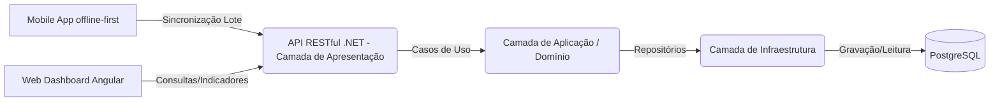

# 🏫 Sistema de Coleta de Dados Escolares (Solução Escalável)

Este repositório contém a documentação e os códigos-fonte da solução desenvolvida para a coleta, armazenamento, sincronização e apresentação de dados socioeconômicos de alunos e suas famílias.

O projeto foi projetado com um foco rigoroso em **escalabilidade**, **resiliência (offline-first)** e **facilidade de manutenção**.

---

## 🏗️ 1. Arquitetura Adotada

Para garantir que o projeto possa escalar desde um colégio comunitário até uma rede inteira de escolas públicas ou privadas, adotamos uma arquitetura orientada a serviços com foco na nuvem (Cloud-Native) e resiliência no lado do cliente.

Para o **Backend em .NET**, adotamos os princípios do **Domain-Driven Design (DDD)** e arquitetura limpa (Clean Architecture). Isso garante que o núcleo das regras de negócio seja completamente isolado de tecnologias de banco de dados ou da interface (API).

### Fluxo de Informações


*   **Mobile App (Coletor):** Trabalha de forma autônoma (offline). Todos os dados são armazenados em um banco local e enviados para o servidor de forma assíncrona assim que houver conectividade. O controle é feito através de **UUIDs**.
*   **Backend (API .NET com DDD):** Atua como o "cérebro" da aplicação. O núcleo do Domínio garante a validação e consistência, enquanto a Infraestrutura persiste no PostgreSQL.
*   **Web Dashboard:** Aplicação SPA (Single Page Application) focada em consumir dados agregados do backend para plotagem de gráficos em tempo real.

---

## 🚀 2. Tecnologias Utilizadas

A pilha de tecnologias escolhida visa suportar alta concorrência e facilitar o desenvolvimento moderno, utilizando as stacks solicitadas:

| Componente | Tecnologia Escolhida | Justificativa |
| :--- | :--- | :--- |
| **Banco de Dados** | `PostgreSQL` | Relacional, excelente performance, suporte nativo a `UUID` e JSONB, ideal para relatórios analíticos no futuro. |
| **Backend / API** | `.NET 8` (C#) com DDD | Extremamente robusto e tipado. A adoção do DDD facilita testes unitários, manutenção de regras complexas e a separação de responsabilidades. |
| **Mobile App** | `Flutter` (Dart) + `SQLite` (ou `Isar`) | Flutter permite compilar para Android e iOS com um único código entregando performance nativa. O banco local viabiliza o comportamento *offline-first* robusto. |
| **Web Dashboard** | `Angular` + `TailwindCSS` + `Chart.js` | Angular é um framework robusto (mantido pelo Google), ideal para SPAs corporativas estruturadas. TailwindCSS ajuda no design responsivo e Chart.js fornece gráficos dinâmicos e limpos. |

---

## 🧠 3. Premissas e Decisões Técnicas

1.  **DDD (Domain-Driven Design):** O backend foi estruturado em quatro camadas (Presentation, Application, Domain, Infrastructure). As Entidades e Agregados (como *Família*, *Aluno*, *Matrícula*) vivem no *Domain* e não possuem dependência de ORM.
2.  **Geração de IDs Descentralizada:** Para viabilizar a arquitetura offline-first, não podemos depender do banco de dados central para gerar IDs. Utilizamos **UUIDs v4** gerados no próprio dispositivo móvel (Flutter) no momento do cadastro.
3.  **Sincronização Resiliente:** Os registros criados no mobile ficam com um status local de `pendente`. Quando a internet volta, o App envia esses registros para o endpoint da API em .NET. O backend processa em lote para não sobrecarregar o banco de dados.
4.  **Segurança e Validação:** As regras de validação ocorrem diretamente no Domínio (Domain Entities) para garantir que um estado inválido nunca seja persistido (fail-fast). As rotas de API (Presentation) exigirão autenticação (JWT).

---

## 🛠️ 4. Estrutura dos Principais Componentes

```text
/
├── mobile-app/         # Código Flutter (Coleta Offline-First)
│   ├── lib/database    # Schemas locais e gerenciamento do SQLite/Isar
│   ├── lib/screens     # Telas do formulário
│   └── lib/services    # Lógica de sincronização HTTP com a API
├── web-dashboard/      # Código Angular (Visualização SPA)
│   ├── src/app/components # Gráficos e Tabelas
│   └── src/app/pages      # Dashboards (Geral, Sócio-econômico)
├── BackendApi/         # Projeto C# / .NET 8 (Estrutura DDD)
│   ├── WebApi/         # Camada Externa: API REST (Controllers)
│   ├── Application/    # Camada de Aplicação: Casos de Uso, DTOs e Serviços
│   ├── Domain/         # Camada de Núcleo: Regras de Negócio e Exceções
│   ├── Entities/       # Entidades e Agregados de Domínio
│   └── Infra/          # Camada de Dados: Entity Framework, Repositórios e DbContext
└── database/           # Scripts SQL (PostgreSQL base)
```

---

## ⚙️ 5. Instruções para Execução (Ambiente de Desenvolvimento)

### 5.1 Configuração do Banco de Dados (via Docker)
Para simplificar o ambiente, providenciamos um arquivo `docker-compose.yml` que já sobe o PostgreSQL com as tabelas criadas automaticamente através de um script de inicialização:
1. Certifique-se de ter o Docker e o Docker Compose instalados.
2. Na raiz do projeto, execute o comando:
   ```bash
   docker-compose up -d
   ```
3. O banco estará disponível na porta `5432` com o usuário `postgres`, senha `password` e o banco de dados `coleta_escolar` já estruturado!

### 5.2 Execução do Backend (API .NET com DDD)
*(Instruções a serem detalhadas após a criação do código)*
1. Acesse a pasta `BackendApi/WebApi` (ou a raiz da Solução `ProjetoBase.sln`).
2. Certifique-se de ter o .NET 8 SDK instalado.
3. Configure o arquivo `appsettings.json` na camada WebApi com a string do PostgreSQL.
4. Execute `dotnet run --project WebApi`. A API iniciará escutando nas portas configuradas.

### 5.3 Execução do Aplicativo Mobile (Flutter)
*(Instruções a serem detalhadas após a criação do código)*
1. Acesse a pasta `mobile-app/`
2. Execute `flutter pub get` para instalar as dependências.
3. Com um emulador ou dispositivo físico conectado, execute `flutter run`.
4. *Nota:* Teste o aplicativo desligando a conexão de rede para verificar o comportamento offline.

### 5.4 Execução do Ambiente Web (Angular)
*(Instruções a serem detalhadas após a criação do código)*
1. Acesse a pasta `web-dashboard/`
2. Execute `npm install`
3. Rode `ng serve`
4. Acesse `http://localhost:4200` no navegador para visualizar as métricas.

---

## 📝 6. Ponto de Atenção e Pendências

- *(A ser atualizado pelo candidato durante a implementação)*
- **Faltante:** A implementação de mensageria (RabbitMQ / Kafka) caso o sistema ganhe escala nacional, para publicar Eventos de Domínio (*Domain Events*) quando um novo aluno for sincronizado. Atualmente, o fluxo é totalmente síncrono.
