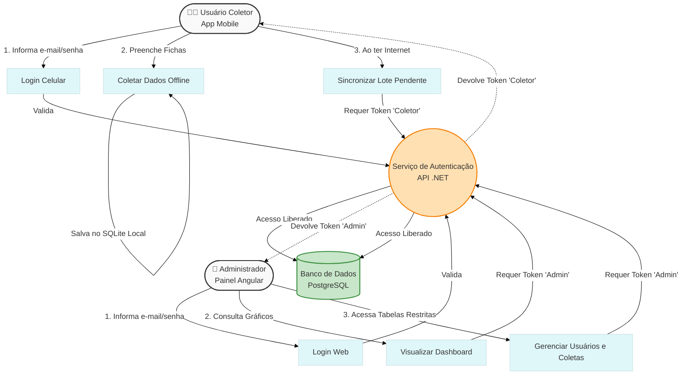

# Diagrama de Caso de Uso: Autenticação e Perfis (Admin vs Coletor)

Este documento ilustra a separação de responsabilidades caso o sistema de Autenticação (Login) com perfis de acesso seja implementado.

## Diagrama de Atores e Fluxos

Abaixo, o diagrama visual representando o fluxo de segurança utilizando JWT (JSON Web Tokens):

## Como Funciona a Restrição
1. O **Serviço de Autenticação** intercepta todas as chamadas.
2. Se o Token JWT tiver a *Claim* (permissão) de `Coletor`, ele só tem passe livre para o endpoint `POST /api/sync`.
3. Se o Token JWT tiver a *Claim* de `Admin`, ele tem passe livre para os endpoints `GET /api/familias`, `GET /api/alunos`, etc.
4. Se um *Coletor* tentar acessar as métricas do painel, a API barra na porta retornando `403 Forbidden` (Proibido).
