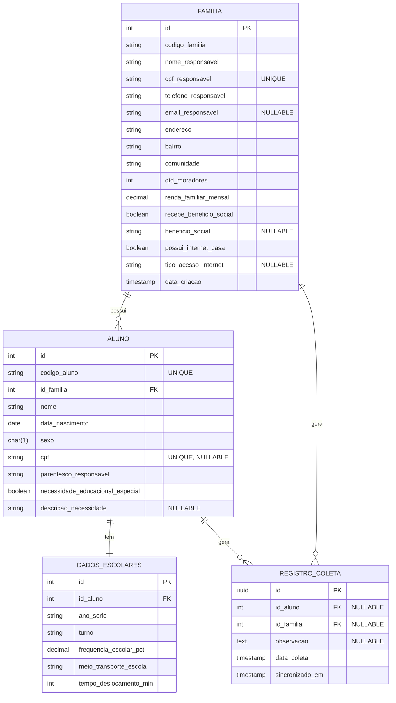

# Modelagem de Banco de Dados e Casos de Uso

## 1. Modelo Entidade-Relacionamento (MER)

Com base na planilha fornecida e nos requisitos, os dados foram normalizados para evitar redundâncias e manter a integridade referencial. 

### Entidades e Atributos

#### `Familia`
Armazena as informações do grupo familiar e dados socioeconômicos.
- `id` (PK, UUID ou Auto-incremento)
- `codigo_familia` (VARCHAR, ex: "FAM-001")
- `nome_responsavel` (VARCHAR)
- `cpf_responsavel` (VARCHAR, UNIQUE)
- `telefone_responsavel` (VARCHAR)
- `email_responsavel` (VARCHAR, NULLABLE)
- `endereco` (VARCHAR)
- `bairro` (VARCHAR)
- `comunidade` (VARCHAR)
- `qtd_moradores` (INT)
- `renda_familiar_mensal` (DECIMAL)
- `recebe_beneficio_social` (BOOLEAN)
- `beneficio_social` (VARCHAR, NULLABLE)
- `possui_internet_casa` (BOOLEAN)
- `tipo_acesso_internet` (VARCHAR, NULLABLE)
- `data_criacao` (TIMESTAMP)

#### `Aluno`
Armazena as informações pessoais de cada estudante, vinculado a uma família.
- `id` (PK, Auto-incremento)
- `codigo_aluno` (VARCHAR, ex: "ALU-1001", UNIQUE)
- `id_familia` (FK -> Familia.id)
- `nome` (VARCHAR)
- `data_nascimento` (DATE)
- `sexo` (CHAR(1))
- `cpf` (VARCHAR, UNIQUE, NULLABLE)
- `parentesco_responsavel` (VARCHAR) - *Qual a relação do aluno com o responsável da família*
- `necessidade_educacional_especial` (BOOLEAN)
- `descricao_necessidade` (VARCHAR, NULLABLE)

#### `DadosEscolares`
Armazena informações sobre o contexto escolar e logístico do aluno. (Pode ter relação 1:1 com o aluno ou 1:N caso armazene histórico por ano).
- `id` (PK)
- `id_aluno` (FK -> Aluno.id)
- `ano_serie` (VARCHAR)
- `turno` (VARCHAR)
- `frequencia_escolar_pct` (DECIMAL)
- `meio_transporte_escola` (VARCHAR)
- `tempo_deslocamento_min` (INT)

#### `RegistroColeta`
Representa o momento em que a pesquisa foi realizada, garantindo a rastreabilidade e suportando o funcionamento *offline first*.
- `id` (PK, UUID para facilitar geração offline no mobile sem colisão)
- `id_familia` (FK -> Familia.id, NULLABLE)
- `id_aluno` (FK -> Aluno.id, NULLABLE)
- `observacao` (TEXT, NULLABLE)
- `data_coleta` (TIMESTAMP)
- `sincronizado_em` (TIMESTAMP) - *Para controle do mobile/API*

---

### Diagrama Lógico Simplificado (Mermaid)

---

## 2. Casos de Uso

Os casos de uso descrevem as interações dos atores (Pesquisador/Agente de Coleta e Gestor Escolar) com o sistema.

### Atores
- **Pesquisador (Mobile):** Responsável por ir a campo e realizar as entrevistas utilizando o aplicativo.
- **Gestor Escolar (Web):** Analisa os dados coletados através do painel na web.

### UC01 - Realizar Cadastro/Coleta de Dados (Mobile)
- **Ator:** Pesquisador
- **Pré-condição:** O pesquisador está autenticado no aplicativo (opcional, dependendo do design de segurança).
- **Fluxo Principal:**
  1. O pesquisador inicia um novo registro de coleta.
  2. O sistema solicita os dados da Família e do Responsável.
  3. O pesquisador preenche os dados e avança.
  4. O sistema solicita os dados do Aluno (ou vários alunos pertencentes à mesma família) e seus dados escolares.
  5. O pesquisador preenche as informações e salva.
  6. O sistema valida os campos obrigatórios.
  7. O sistema gera um ID único (UUID) e salva o registro localmente no banco de dados do dispositivo (SQLite/Realm).
  8. O sistema exibe mensagem de sucesso.

### UC02 - Sincronizar Dados Coletados (Mobile -> API)
- **Ator:** Pesquisador / Sistema
- **Pré-condição:** O dispositivo possui conexão com a internet e existem registros locais não sincronizados.
- **Fluxo Principal:**
  1. O sistema detecta conexão com a internet ou o pesquisador clica em "Sincronizar".
  2. O sistema busca todos os registros locais cujo status seja "pendente de sincronização".
  3. O aplicativo envia uma requisição (POST) para a API com o lote de dados (JSON).
  4. A API valida, processa e persiste os dados no Banco de Dados Central.
  5. A API retorna status de sucesso.
  6. O aplicativo atualiza o status dos registros locais para "sincronizado".
- **Fluxo Alternativo (Erro de Conexão):** Se houver falha, os dados permanecem como pendentes e uma nova tentativa será feita no futuro, garantindo o modo *offline first*.

### UC03 - Visualizar Dashboard de Indicadores (Web)
- **Ator:** Gestor Escolar
- **Pré-condição:** O gestor acessa o ambiente web.
- **Fluxo Principal:**
  1. O gestor acessa a página inicial do painel.
  2. O sistema (Frontend) requisita os indicadores para a API.
  3. A API processa e retorna os totalizadores:
     - Total de alunos cadastrados.
     - Total de famílias pesquisadas.
     - % de alunos com necessidade educacional especial.
     - Distribuição de alunos por meio de transporte.
  4. O sistema exibe cards numéricos e no mínimo 3 gráficos (ex: Gráfico de Pizza de Benefícios Sociais, Gráfico de Barras de Turno e Ano, Gráfico de Linha de Frequência Média).

### UC04 - Consultar Registros Detalhados (Web)
- **Ator:** Gestor Escolar
- **Pré-condição:** O gestor acessa a tela de "Consultas".
- **Fluxo Principal:**
  1. O gestor acessa a listagem de registros.
  2. O sistema exibe uma tabela paginada com a lista de alunos e famílias cadastradas.
  3. O gestor pode aplicar filtros (ex: buscar por nome do aluno, bairro ou por quem recebe benefício).
  4. O gestor pode clicar em um registro para ver todos os detalhes da família e os dados escolares completos daquele aluno.
