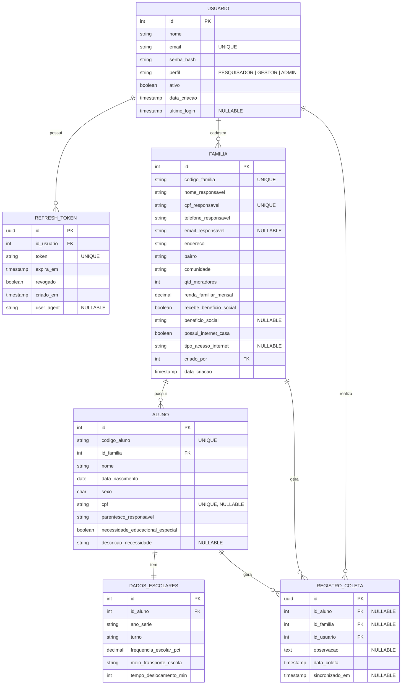
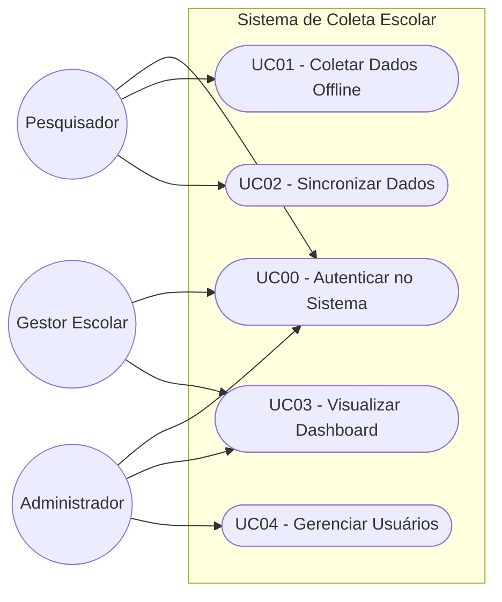

# Modelagem de Banco de Dados e Casos de Uso — v2 (com Autenticação JWT)

> **Versão 2:** Adiciona controle de acesso com autenticação via **JWT (JSON Web Token)**, perfis de usuário e rastreabilidade de quem realizou cada coleta.

---

## 1. Modelo Entidade-Relacionamento (MER)

Com base na planilha fornecida e nos requisitos, os dados foram normalizados para evitar redundâncias e manter a integridade referencial. Nesta versão, foram incorporadas as entidades `Usuario` e `RefreshToken` para suportar autenticação segura e renovação de sessão.

### Entidades e Atributos

#### `Usuario`
Representa os usuários do sistema (pesquisadores de campo e gestores escolares).
- `id` (PK, Auto-incremento)
- `nome` (VARCHAR)
- `email` (VARCHAR, UNIQUE)
- `senha_hash` (VARCHAR) — *hash bcrypt da senha, nunca texto plano*
- `perfil` (ENUM: `PESQUISADOR`, `GESTOR`, `ADMIN`) — *controla o nível de acesso*
- `ativo` (BOOLEAN, DEFAULT TRUE)
- `data_criacao` (TIMESTAMP)
- `ultimo_login` (TIMESTAMP, NULLABLE)

#### `RefreshToken`
Armazena os tokens de renovação de sessão JWT para invalidação controlada (logout e rotação de tokens).
- `id` (PK, UUID)
- `id_usuario` (FK -> Usuario.id)
- `token` (VARCHAR, UNIQUE) — *hash do refresh token*
- `expira_em` (TIMESTAMP)
- `revogado` (BOOLEAN, DEFAULT FALSE)
- `criado_em` (TIMESTAMP)
- `user_agent` (VARCHAR, NULLABLE) — *informação do dispositivo/browser*

#### `Familia`
Armazena as informações do grupo familiar e dados socioeconômicos.
- `id` (PK, Auto-incremento)
- `codigo_familia` (VARCHAR, UNIQUE, ex: "FAM-001")
- `nome_responsavel` (VARCHAR)
- `cpf_responsavel` (VARCHAR, UNIQUE)
- `telefone_responsavel` (VARCHAR)
- `email_responsavel` (VARCHAR, NULLABLE)
- `endereco` (VARCHAR)
- `bairro` (VARCHAR)
- `comunidade` (VARCHAR)
- `qtd_moradores` (INT)
- `renda_familiar_mensal` (DECIMAL)
- `recebe_beneficio_social` (BOOLEAN)
- `beneficio_social` (VARCHAR, NULLABLE)
- `possui_internet_casa` (BOOLEAN)
- `tipo_acesso_internet` (VARCHAR, NULLABLE)
- `criado_por` (FK -> Usuario.id) — *rastreabilidade: qual pesquisador cadastrou*
- `data_criacao` (TIMESTAMP)

#### `Aluno`
Armazena as informações pessoais de cada estudante, vinculado a uma família.
- `id` (PK, Auto-incremento)
- `codigo_aluno` (VARCHAR, UNIQUE, ex: "ALU-1001")
- `id_familia` (FK -> Familia.id)
- `nome` (VARCHAR)
- `data_nascimento` (DATE)
- `sexo` (CHAR(1))
- `cpf` (VARCHAR, UNIQUE, NULLABLE)
- `parentesco_responsavel` (VARCHAR)
- `necessidade_educacional_especial` (BOOLEAN)
- `descricao_necessidade` (VARCHAR, NULLABLE)

#### `DadosEscolares`
Armazena informações sobre o contexto escolar e logístico do aluno.
- `id` (PK, Auto-incremento)
- `id_aluno` (FK -> Aluno.id)
- `ano_serie` (VARCHAR)
- `turno` (VARCHAR)
- `frequencia_escolar_pct` (DECIMAL)
- `meio_transporte_escola` (VARCHAR)
- `tempo_deslocamento_min` (INT)

#### `RegistroColeta`
Representa o momento em que a pesquisa foi realizada. Suporta funcionamento *offline first* e registra o responsável pela coleta.
- `id` (PK, UUID — gerado no mobile, evita colisão offline)
- `id_familia` (FK -> Familia.id, NULLABLE)
- `id_aluno` (FK -> Aluno.id, NULLABLE)
- `id_usuario` (FK -> Usuario.id) — *pesquisador que realizou a coleta*
- `observacao` (TEXT, NULLABLE)
- `data_coleta` (TIMESTAMP)
- `sincronizado_em` (TIMESTAMP, NULLABLE)

---

### Diagrama Entidade-Relacionamento Completo (Mermaid)



---

## 2. Estratégia de Autenticação — JWT

### Fluxo de Autenticação

```
[App Mobile / Web]
      |
      | POST /auth/login { email, senha }
      v
[API Backend]
      |-- Valida credenciais no banco
      |-- Gera Access Token (JWT, expiração curta: 15 min)
      |-- Gera Refresh Token (UUID opaco, expiração longa: 7 dias)
      |-- Salva hash do Refresh Token na tabela refresh_tokens
      |
      v
[Resposta]: { access_token, refresh_token }

[Requisições Autenticadas]
      |
      | Authorization: Bearer <access_token>
      v
[API Backend]
      |-- Valida assinatura e expiração do JWT
      |-- Lê perfil do usuário do payload
      |-- Autoriza ou rejeita a operação
```

### Renovação de Sessão (Token Rotation)

```
POST /auth/refresh { refresh_token }
  -> API valida o token na tabela refresh_tokens
  -> Revoga o token antigo (revogado = true)
  -> Emite novo access_token + novo refresh_token
  -> Salva o novo refresh_token no banco
```

### Controle de Acesso por Perfil (RBAC)

| Endpoint / Ação                  | PESQUISADOR | GESTOR | ADMIN |
|-----------------------------------|:-----------:|:------:|:-----:|
| `POST /coletas` (criar coleta)    | ✅          | ❌     | ✅    |
| `GET /coletas` (listar próprias)  | ✅          | ✅     | ✅    |
| `GET /coletas/all` (listar todas) | ❌          | ✅     | ✅    |
| `GET /dashboard`                  | ❌          | ✅     | ✅    |
| `POST /usuarios` (criar usuário)  | ❌          | ❌     | ✅    |
| `DELETE /coletas/:id`             | ❌          | ❌     | ✅    |

---

## 3. Casos de Uso

### Atores
- **Pesquisador (Mobile):** Coleta dados em campo utilizando o aplicativo.
- **Gestor Escolar (Web):** Analisa os dados coletados no painel web.
- **Administrador:** Gerencia usuários e configurações do sistema.

### Diagrama de Casos de Uso




### UC00 - Autenticar no Sistema (Mobile / Web) *(novo)*
- **Ator:** Qualquer usuário
- **Fluxo Principal:**
  1. O usuário informa e-mail e senha.
  2. A API valida as credenciais e verifica se a conta está ativa.
  3. A API gera um **Access Token JWT** (15 min) e um **Refresh Token** (7 dias).
  4. O Refresh Token é armazenado de forma segura no dispositivo (HttpOnly cookie na Web / SecureStore no Mobile).
  5. O usuário é redirecionado para a tela principal com o perfil correspondente.
- **Fluxo Alternativo (Token Expirado):** O app envia o Refresh Token para `/auth/refresh`. A API revoga o token antigo e emite um novo par de tokens (rotação).
- **Fluxo Alternativo (Credenciais Inválidas):** A API retorna HTTP 401. Após 5 tentativas consecutivas falhas, a conta é temporariamente bloqueada por 15 minutos.

### UC01 - Realizar Cadastro/Coleta de Dados (Mobile)
- **Ator:** Pesquisador
- **Pré-condição:** O pesquisador está autenticado com perfil `PESQUISADOR`.
- **Fluxo Principal:**
  1. O pesquisador inicia um novo registro de coleta.
  2. O sistema solicita os dados da Família e do Responsável.
  3. O pesquisador preenche os dados e avança.
  4. O sistema solicita os dados do Aluno e seus dados escolares.
  5. O pesquisador preenche as informações e salva.
  6. O sistema valida os campos obrigatórios.
  7. O sistema gera um UUID e salva o registro localmente com `id_usuario` do pesquisador logado.
  8. O sistema exibe mensagem de sucesso.

### UC02 - Sincronizar Dados Coletados (Mobile -> API)
- **Ator:** Pesquisador / Sistema
- **Pré-condição:** Conexão com internet e registros pendentes existentes.
- **Fluxo Principal:**
  1. O sistema detecta conexão ou o pesquisador aciona "Sincronizar".
  2. O aplicativo inclui o **Access Token JWT** no cabeçalho `Authorization`.
  3. O aplicativo envia os registros pendentes em lote via `POST /sync`.
  4. A API valida o token, extrai o `id_usuario` do payload JWT e associa aos registros.
  5. A API persiste os dados no banco central e retorna confirmação.
  6. Os registros locais são marcados como "sincronizado".
- **Fluxo Alternativo (Token Expirado durante sync):** O app renova o token via `/auth/refresh` e retenta a sincronização automaticamente.

### UC03 - Visualizar Dashboard de Indicadores (Web)
- **Ator:** Gestor Escolar (perfil `GESTOR` ou `ADMIN`)
- **Pré-condição:** Usuário autenticado com perfil adequado.
- **Fluxo Principal:**
  1. O gestor acessa o painel.
  2. O Frontend envia a requisição com o JWT no cabeçalho.
  3. A API valida o token e verifica se o perfil tem permissão (`GESTOR` ou `ADMIN`).
  4. A API retorna os indicadores: totais, percentuais e distribuições.
  5. O sistema exibe cards e gráficos.

### UC04 - Consultar Registros Detalhados (Web)
- **Ator:** Gestor Escolar
- **Pré-condição:** Usuário autenticado.
- **Fluxo Principal:**
  1. O gestor acessa a listagem de registros.
  2. O sistema exibe uma tabela paginada com os registros, incluindo o nome do pesquisador que coletou cada dado.
  3. O gestor pode aplicar filtros por nome, bairro, pesquisador, data da coleta, etc.
  4. O gestor pode clicar em um registro para ver todos os detalhes completos.

### UC05 - Gerenciar Usuários (Web — Admin) *(novo)*
- **Ator:** Administrador (perfil `ADMIN`)
- **Pré-condição:** Usuário autenticado como `ADMIN`.
- **Fluxo Principal:**
  1. O administrador acessa a gestão de usuários.
  2. O sistema lista todos os usuários com seus perfis e status.
  3. O administrador pode criar, editar, ativar ou desativar contas.
  4. O administrador pode forçar logout de um usuário (revogando todos os seus refresh tokens).

---

## 4. Decisões de Modelagem

| Decisão | Justificativa |
|---------|---------------|
| **Access Token com expiração curta (15 min)** | Limita a janela de exposição em caso de vazamento do token. |
| **Refresh Token armazenado como hash no banco** | Nunca salvar tokens sensíveis em texto plano; a invalidação é segura. |
| **Rotação de Refresh Token** | A cada renovação, o token antigo é revogado, dificultando uso indevido de tokens capturados. |
| **UUID como PK de `RegistroColeta`** | Permite geração offline no dispositivo sem risco de colisão de IDs ao sincronizar. |
| **Campo `criado_por` em `Familia`** | Rastreabilidade de auditoria — saber qual pesquisador inseriu cada família. |
| **Campo `id_usuario` em `RegistroColeta`** | Associa cada coleta ao pesquisador responsável, viabilizando relatórios por pesquisador. |
| **ENUM de perfis (RBAC simples)** | Solução leve e suficiente para o escopo do projeto; pode evoluir para uma tabela de permissões se necessário. |
